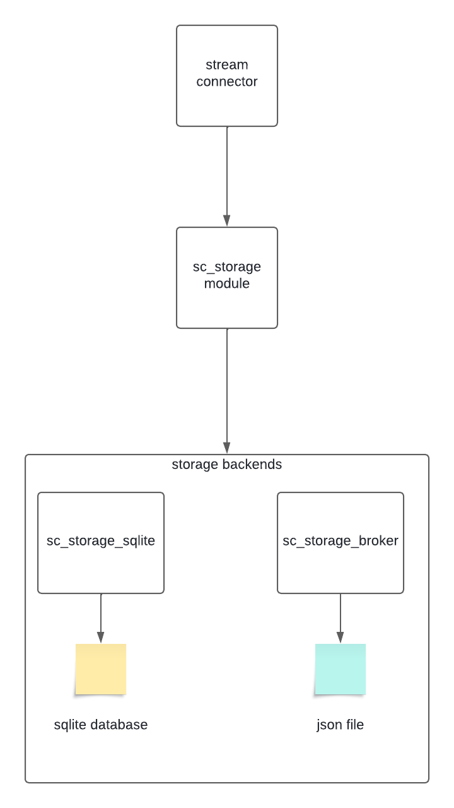

# How to write a storage backend

- [How to write a storage backend](#how-to-write-a-storage-backend)
  - [Introduction](#introduction)
  - [Architecture](#architecture)
  - [Developement guidelines](#developement-guidelines)
    - [Name of your backend](#name-of-your-backend)
    - [mandatory functions](#mandatory-functions)
    - [Data types](#data-types)
    - [Parameters](#parameters)
  - [Documentation](#documentation)

## Introduction

This guidelines documentation will explain how the stream connectors internal storage system is working and how it communicates with the available backends.

Based on that, it will cover what a backend must do, how it should do it and what it could do.

Stream connectors need their own storage system because they can't store data in the broker cache. It is not theirs and it is not supposed to be.

What can be confusing is that broker can also become a storage backend for stream connectors. Meaning that it will provide methods to stream connectors to help them store data and retrieve it. (not yet possible)

## Architecture

- a stream connector communicates with the sc_storage wrapper. It is up to the sc_storage wrapper to use the appropriate backend to deliver a storage mecanism.
- the backend is selected by the parameter **storage_backend**. Its default value is **broker**

## Developement guidelines

### Name of your backend

- Your backend Lua module must created be under the centreon-stream-connectors-lib/storage_backends directory.
- Its name must be prefixed by **sc_storage_**
- Its name must be unique

for example : centreon-stream-connectors-lib/storage_backends/sc_storage_sqlite.lua

### mandatory functions

A storage backend is a Lua module that must implement the following methods:

- .new() (it is a module so it needs a constructor)
- set()
- set_multiple()
- get()
- get_multiple()
- delete()
- delete_multiple()
- show()
- clear()

When implementing them in your cache backend, you must follow the below rules:

- you need the exact same function parameter
- you need to return the exact same value

All those functions are documented [here](../sc_storage.md)

### Data types

Stream connectors are mostly working around the below data types:

- strings
- numbers
- booleans
- tables

You absolutely must keep this coherent. If you store the `true` boolean for a property, you shouldn't get the `"true"` string when retrieving the value.

For some storage mecanism it is kind of easy because they work well with Lua data types.

For example, it is easy to store those data types in a json file.

On the other hand, storing all those data types in a table from any database can be tricky. Here is how it has been done for the sqlite storage backend

- four columns
  - one for the object_id
  - one for the property name
  - one for the property value
  - one for the data type
- every data is stored as a string but the original data type is stored in the data type column
  - strings are still strings
  - numbers are now strings (tostring() function)
  - boolean are strings (tostring() function)
  - tables are json encoded (broker.json_encode() function) and therefore are strings
- when retrieving data everything is converted back to its original data type thanks to the data type column
  - strings are still strings
  - numbers are retrieved with the tonumber() function
  - boolean are retrieved using a custom function (that does a basic if "true")
  - tables are converted using the broker.json_decode() function

### Parameters

Each storage backend can have its own set of parameters. To create them you must follow two rules

- you need to add the parameter in the sc_params.lua Lua module under the `-- storage parameters` part (this is for the sake of readability)
- it must use the following syntax `sc_storage.<storage_backend_name>.<param_name>` where:
  - <storage_backend_name> must be the name of your storage backend (for example for the sc_storage_sqlite backend it is everything that comes after sc_storage_ therefore it is "sqlite")
  - <param_name> is just your param name

For example, the sqlite backend needs a parameter to know the name of database file name. This parameter is named as follow:

sc_storage.sqlite.db_file

## Documentation

Obviously the backend must be documented, even the functions that are already documented in the [storage wrapper documentation](../sc_storage.md).
The aforementioned documentation is a good example on how your storage module must be documented.

You must also  add your functions in the global function index in the [README.md file](../README.md)